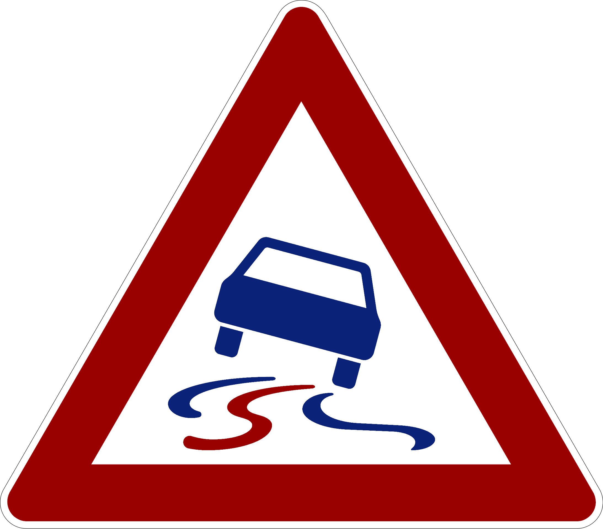

The source code for the flutter app of the DCAITI project: "KI-basierte Algorithmen zur Objektdetektion und Klassifizierung für mobile Plattformen".
The Machine learning project can be found [here](https://github.com/CaptainDario/street_sign_detection_ml).

## Installation

### From release

*Note: releases are only available for android*
Head over to the [releases section](https://github.com/CaptainDario/street_sign_detection_app/releases/latest) and download the latest release for android, and install it.
You should be good to go!

### From source

**Note** Flutter needs to be installed on this system.

1. Clone this repo `git clone https://github.com/CaptainDario/street_sign_detection_app`
2. Change in its directory `cd street_sign_detection_app`
3. Run `flutter pub get` in this app's directory
4. Copy all `.tflite` files from the release you want to use to the `assets`-directory of this project

Android setup
1. Copy the tensorflow binaries from [this release]() to 
  1. `libtensorflowlite_c_arm64.so` -> `android/app/src/main/jniLibs/arm64-v8a/libtensorflowlite_c.so`
  2. `libtensorflowlite_c_armeabi.so` -> `android/app/src/main/jniLibs/armeabi-v7a/libtensorflowlite_c.so`
  3. `libtensorflowlite_c_x86.so` -> `android/app/src/main/jniLibs/x86_64/libtensorflowlite_c.so`

Now you should be able to run the app:

`flutter run`

## Sample video

TODO: add a sample video here

## Disclaimer

This is a proof of concept implementation of a cross platform tensorflow lite based street sign detection app.
Its purpose is to check the viability of on-device machine learning on off-the-shelf mobile hardware for autonomous driving. This means that the app or parts of it are not meant to be used in production and are not tested with a wide range of devices. Therefore, expect bugs and crashes on untested devices.

## Credits

[icon](https://de.m.wikipedia.org/wiki/Bildtafel_der_Verkehrszeichen_in_der_Bundesrepublik_Deutschland_seit_2017#/media/Datei%3AZeichen_114_-_Schleuder-_oder_Rutschgefahr%2C_StVO_2013.svg)
